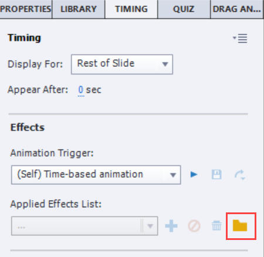

# Captivate Syncing
This is the feature we use most often here at Infosemantics and is the primary reason why we developed CpMate in the first place.

This feature allows Adobe Animate HTML5 exports to play back inside of Captivate without losing sync with the Captivate timeline. When implemented properly, even if Captivate and Animate are playing back at different frame rates, there will be certain **jump points** where Animate will be forced back into sync with the Captivate timeline.

## Step 1: Setting Animation Pause Points
Let's say you're building an animation for a slide which has one minute of voice-over. Generally speaking, you would not need to have something moving on stage on every second of that minute. It's quite likely your animation will end up being something like this:
- (0 to 10 seconds) Animate in the subject of the slide.
- (10 to 20 seconds) An 'incident' happens to the subject. The animation for the incident takes only three seconds. But the voice-over will continue to talk about it for another 7.
- (20 to 40 seconds) The subject tries different ways to deal with the 'incident', but with no success.
- (40 to 50 seconds) The subject finds the correct way to deal with the problem.
- (50 to 60 seconds) The voice-over restates the lesson learned, and the subject transitions out.

Out of those 60 seconds there may be only 30-40 seconds of actual movement. The rest of the time the slide is still to allow the audience time to read what is happening. It's this 'still' time CpMate takes advantage of to make sure the animation stays in sync with the voice-over.

### Mark still points with stop actions
Keeping with the above example, let's say the opening 30 frames are all you need to animate your subject in. Thereafter, there is no movement on the slide until frame 100. In the intervening 70 frames there is potential for the animation to drift out of sync with the voice-over. So here's what we do:

1. Add a layer called **Actions** to your timeline.
2. On this layer add a blank keyframe on frame 30. Select this keyframe.
3. Open the Actions Panel by going to Window > Actions (Or press F9)
4. Enter the following code:

```
this.stop();
```

This will cause the timeline playback to stop at this frame. If no further action is taken, nothing beyond this frame will be displayed. Though note, any MovieClip symbols shown on the timeline will continue to playback even if their parent timeline is paused.

::: tip Previewing from Adobe Animate
Due to these stop actions, if you preview your animation from Adobe Animate the animation will only play so far and then stop before completion. But what if you wanted to preview what the animation looks like *after* the stop action?

Just click anywhere on the stage to force the timeline to keep playing. That's another CpMate feature for your convenience.
:::

### Mark kick-off points with slide labels
Of course, you want your animation to start playing again at some point. In the above example we know this will be frame 100. So now we need to mark frame 100 as the next 'kick-off point' for our animation.

1. Add a layer called **labels** to your timeline.
2. On this layer add a black keyframe to frame 100. Select that keyframe
3. In the properties panel add a label to this frame. Let's call this one: 10

**IMAGE HERE**

That's it! Now repeat steps 1 and 2 to make the next pause and kick-off points. Keep doing this until you reach the end of the animation.

Now export an OAM and import it into your Captivate slide. The rest of the workflow happens in the Adobe Captivate app.

::: danger Slide labels must numbers
It would be great if you could give this slide label a descriptive name. However, due to limitations with custom Captivat effects, this label **must** be a **number**.

Therefore, in house we usually use the following naming method.

- The first kick off point is labeled: 10
- The second point is labeled: 20
- The third: 30
- So on.

The idea being that if at a later time you realise you need to add another pause and kick-off point in the middle of your animation (say between labels 20 and 30) you have space in the number spectrum to add a label (say: 25)
:::

## Step 2: Include the GotoLabel custom effect in your project
In the previous step, Animate pauses it's playback and sets up a flag to let Captivate know where the animation can start playing again. As the Captivate timeline holds the voice-over clip, it knows at what point the animation should continue. But how do we mark that point? We can do so by using a custom effect.

Captivate Effects can be added to an object to describe the nature and timing of an animation. These effects will appear on the timeline underneath the object they are attached to.

**IMAGE HERE**

Captivate allows you to create and import custom effects. The **CpExtra** (Not CpMate) install files include a file called: **GotoLabel.xml**. This file is a custom effect and can be imported into Adobe Captivate in the following way:

1. Select the Animate OAM Web Object.
2. Go to the Timing tab.
3. Click the folder icon.



4. Navigate to the GotoLabel.xml and select it.

You can now use this GotoLabel effect anywhere in this Captivate project. If you create a new Captivate project you will need to import it again.

## Step 3: Time effects to sync with voice-over
The GotoLabel effect has a special relationship with CpExtra. CpExtra can detect when this effect starts playing on the timeline. It can then read the instructions we include within the effect and based on that control the playback of the Animate Animation.

Let's return to our example. Our Animate OAM has marked the next kick off point of the animation with the slide label: 10. As the name of the GotoLabel effect implies, we can use this effect to make the Animate OAM move to this frame and play. Here's how:

1. In Captivate, select the Animate OAM Web Object.
2. Go to the Tming tab.
3. Above the Effects selection area is a drop down menu that allows you to pick an effect category. By default it will say: Basic. Open that drop down menu a chose: Custom

**IMAGE HERE**

4. Choose the GotoLabel Effect. Options for the GotoLabel effect should now appear below.
5. In the effect options, enter the name of the slide label in the **slide label** field. In our example that would be 10.

**IMAGE HERE AND CHECK INSTRUCTIONS FOR ACCURACY**

6. In the timeline panel, you should see this effect appear underneath the Web Object. Drag the effect so that it **starts** at the point in the voice-over that matches up with the animation you will trigger.

If you have more than one kick-off point, add a new effects for each kick off point and repeat steps 3 - 6. You should now be able to test the Captivate slide and see the animation plays back, with the timing of each effect determining when each animation kick off point runs.

::: warning Don't overlap effects
It is very important that effects for one object do not overlap each other. Otherwise, CpExtra has difficulty telling when one effect starts and the other ends.

**IMAGE HERE**
:::

Congratulations! You now know how to ensure the Adobe Animate OAM will never lose sync with the voice-over in the Captivate timeline. Even if the Adobe Animate animation bogs down and plays back slower than exepcted, each kick-off point will serve as a refresh.

## Notes
- Of course with this method you don't have to have any 'still frames' on the Adobe Animate timeline at all. You can just include your animation content on the timeline, punctuated with stop actions and kick off labels, and then allow the Adobe Captivate effects to manage how much of a pause there would be from one point in the animation to another.
- This feature is also very useful for multi-lingual projects. Previously, when you swapped to another language's voice-over clip you'd have to create a whole new animation because the amount of time it would take to say the same information would differ from language to language. With well thoughtout pause and kick-off points, you may be able to use the same Adobe Animate document for every language of your course.
- It takes a bit of time to identify when it's worth creating a new pause and kick-off point and when it's better for the animation to just play through. Is one second of stillness long enough to justify a pause and kick-off point? Probably not. What about two seconds? I can't answer that. The more you get used to working with CpMate the more you'll 'get your eye in' for this process.
