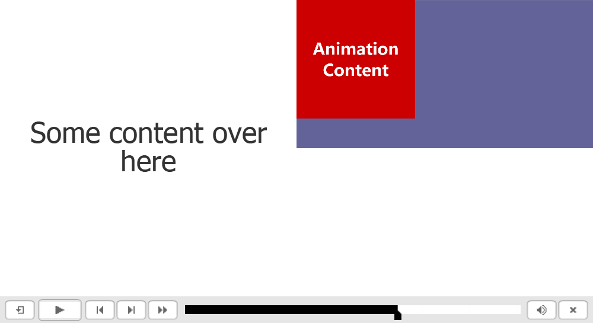
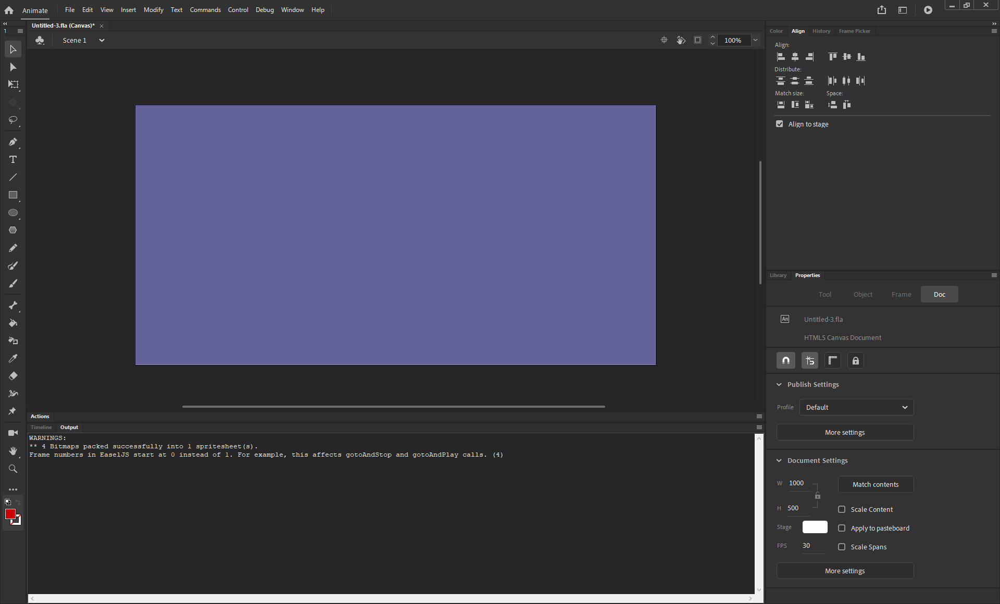
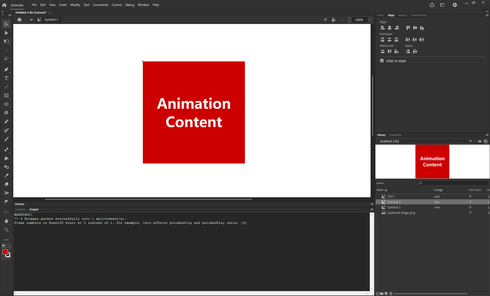

# Custom Stage Size
If you're using [X.preferences.linkNameToLibrarySymbol](./mutliple-animations) you may find you want the stage size to change from one animation to another.

For example, let's say on Captivate's **slide 1** you'll display Animate's **animation_1**. This animation takes up most of the slide real-estate.


However, on Captivate's **slide 2** you'll display Animate's **animation_2**. This animation will take up only a small square space in one part of the slide.



Your Animate document's stage size is set to match animation_1. Which is longer than it is wide.



However, you have build animation_2 to only take up a 1:1 ratio of screen size.



That is why when you view the Captivate output animation_1 looks quite good, but animation_2 looks squished

The primary problem being that the ratios of expected stage size between these two animations are different, but Animate can only account for one.

However, CpExtra allows you to specify a unique stage size for every animation with the following preferences:

- [X.preferences.stageWidth](../javascript-api/preferences.html#x-preferences-stagewidth)
- [X.preferences.stageHeight](../javascript-api/preferences.html#x-preferences-stageheight)

## Defining an Animation's Stage Size
First of all, work out in pixels the exact height and width you wish the stage size to be. To continue the example above, let's say animation_2's stage height and width should both be 400.

You'd then open the animation MovieClip, add an actions layer and then on the first frame include the following code:

``` js
X.preferences.stageWidth = 400;
X.preferences.stageHeight = 400;
```

With that change when we re-publish and update in Captivate, we'll see the following result for animation_2


Like with [outer rendering](./outer-rendering), this setting overrides certain Animate publish settings. [See here for more information.](./outer-rendering.html#overriding-publish-settings)
