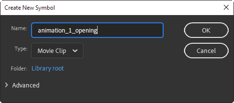
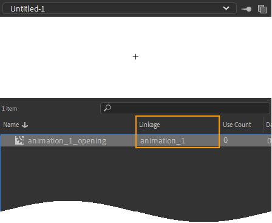

# Multiple Animations in One Project
Captivate projects typically need multiple animations spread over different slides. CpMate allows you to include multiple animations in a single Adobe Animate project, and therefore, a single OAM file.

By default this feature is not enabled. It can be enabled by doing the following:

1. In Adobe Animate, go to the main timeline.
2. Create a layer called **Actions** and select the first frame.
3. Open the Actions panel by going to Window > Actions (or press F9)
4. Enter the following code:

``` js
X.preferences.linkNameToLibrarySymbol = true;
```

From this point on, CpMate will **not expect you to include any animation on the Animate Main Timeline**. Instead, it will expect you to place your animation within MovieClip symbols. If everything is set up correctly, CpMate will know which of these animations you want to play, and display it.

## Creating Animations Inside MovieClips
With linkNameToLibrarySymbol set up, you create new animations like so:

1. Go to Insert > New Symbol
2. In the Create New Symbol dialog box, name your symbol and give it a type of MovieClip.



3. Configure any other settings as you so desire and click OK.
4. Open the Library and find the symbol you just created.
5. In the library's **Linkage** column this symbol should display an empty space. Double-click this space.



6. Enter a name. This name will be used to identify your animation in Captivate. This name can have no spaces or special characters. Underscores '\_' are allowed. Name must be unique.
7. Press Enter.

From now on, build your animation in this MovieClip just like you would on the Main Timeline. Repeat the above steps to make another independant animations.

These animations can share symbols. This improves efficiency as shared assets will not need to be downloaded more than once.

You can add [pause and kick-off points](./captivate-syncing) to the MovieClip's timeline to use the Captivate timeine syncing features.

::: tip Stage boundaries
When building animations on the main timeline, Animate made it obvious where the boundaries of the stage are. You will not have this convenience when working inside a MovieClip.
A common workaround is to create a guide layer in your symbol and then place a rectangle in that guide layer which has the same dimensions as the stage. As this is a guide layer, the rectangle will not be exported, but will give you an easy visual reference as to when something appears or disappears from stage.
:::

## Previewing Animations inside MovieClips
If you've been following the instructions so far, you'll find that testing the Animate movie at this point will leave you with a blank export. This is because the animations are stored in the library rather on the Main Timeline.

Therefore, CpMate provides a setting that allows you to define which animation you want to view when the project is previewed.

Let's say you had an animation with a linkage of **animation_1**. You could set that animation as the one you wish to preview like so:

1. Go to the Animate Main Timeline.
2. Select your actions frame (where you already set up linkNameToLibrarySymbol)
3. Enter the following code:

``` js
X.preferences.preview = "animation_1";
```

4. Preview the movie with ctrl + Enter (cmnd + Return)
5. **animation_1** runs in the output

In practice, you'll likely be jumping back and forth between previewing animations. Therefore, we suggest you have something like the following:

``` js
// X.preferences.preview = "animation_1";
// X.preferences.preview = "animation_2";
// X.preferences.preview = "animation_3";
// X.preferences.preview = "animation_4";
X.preferences.preview = "animation_5";
// X.preferences.preview = "animation_6";
```

With this code, when you want to test animation_3, just add two forward slashes // to comment out the animation_5 line, then delete the two slashes before the animation_3 line. Animate will ignore any lines of code proceeded by two forward slashes //

## Specifying Animations in Captivate
Once a linkNameToLibrarySymbol Adobe Animate project has exported it's OAM and the OAM is imported into Captivate, we can place an instance of this OAM on each slide we desire to show an animation. However, how can we define which of the animations we desire to show?

Simple.

1. Select the Web Object
2. Go to the Properties Panel
3. Change the web object's name to match the animation's **linkage**

Now when you preview the Captivate, Web Object will display the linked animation. You can even use the GotoFrame effect to sync the animation's playback to the timeline.


::: tip Displaying the same animation multiple times
What if you had a single animation that you wanted to display on multiple Captivate slides? You may run into a problem, because Captivate requires every object to have a unique name. Therefore, only one Web Object on one slide could be named: my_animation

However, you *can* show multiple instances of the same animation, by putting a underscore followed by a number after the linkage name.

If you had an animation called **my_animation**, then naming the Web Object any of the following would cause it to display **my_animation**:
- my_animation
- my_animation_1
- my_animation_9
- my_animation_90
:::

