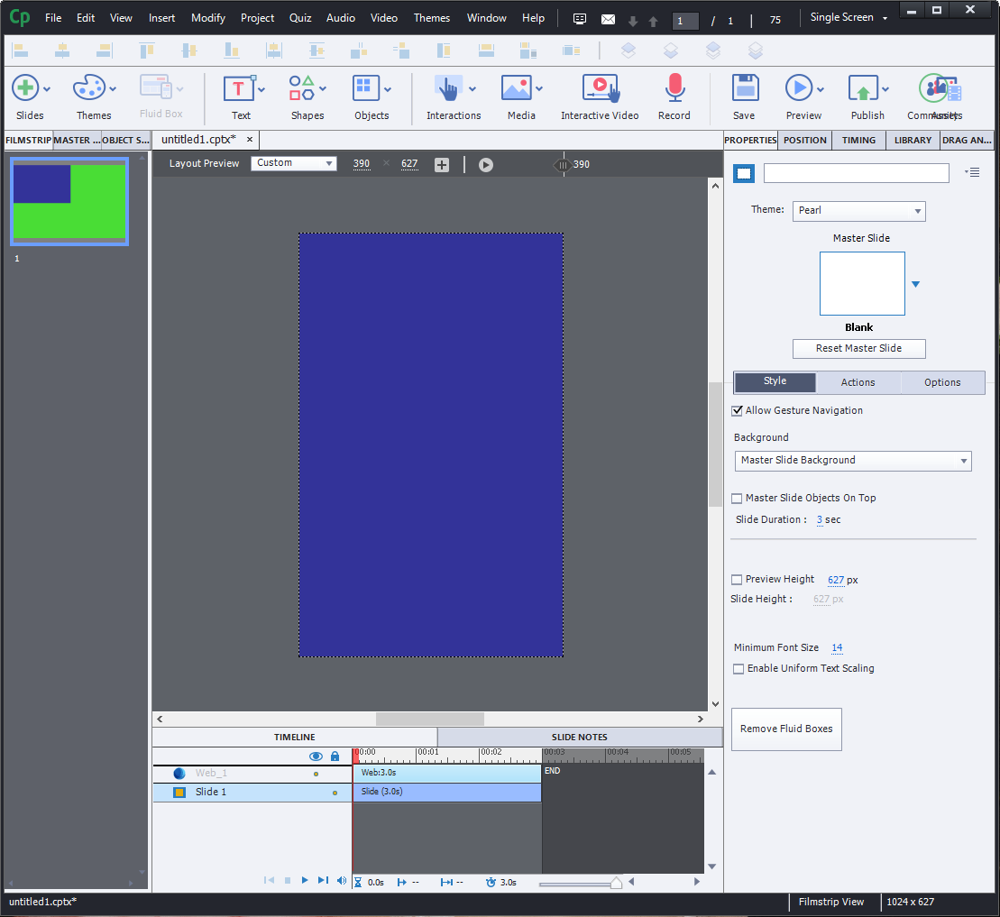
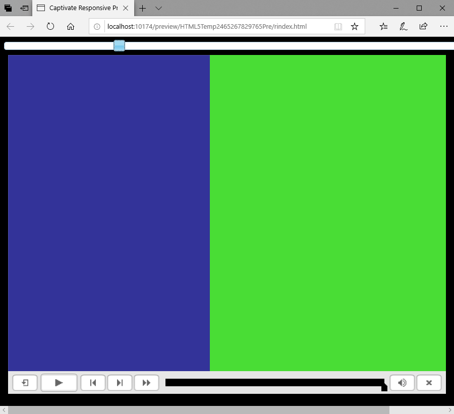
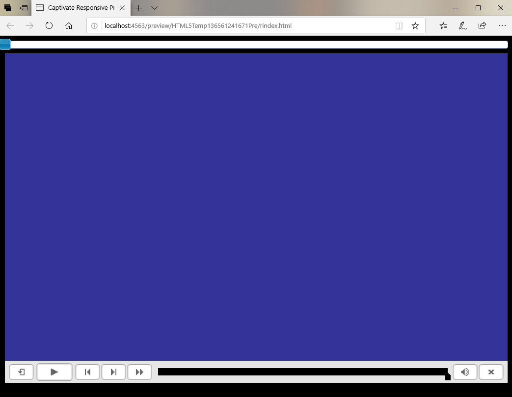
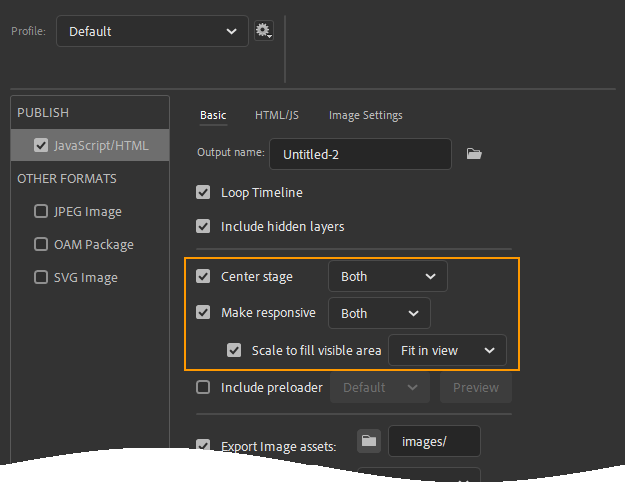

# Outer Rendering
Sometimes you are faced with a situation where you do not know how large an area the Adobe Animate OAM is expected to display in.

Take the following as an example.



This is a Captivate responsive project using fluid boxes. This slide has a single fluid box which takes up the entire slide. The purple area is the Animate OAM, which has been placed inside this fluid box and its maintain aspect ratio option turned off. Therefore, the Animate OAM's size is directly linked to the size of the Captivate Stage.

Let's say in the above screen shot the Captivate stage was at a size of 400 pixels wide and 800 pixels high. So you make sure your Adobe Animate stage is also 400 pixels wide and 800 pixels high. That way you can make sure your animation is making full use of the slide.

However, this is a responsive project. The Captivate stage height and width is not fixed. If you were looking at this project on a tablet's landscape view the stage width could increase twice as much.



In the above picture we can still see the purple of the Animate stage, but we also a green colour. That's the colour we've given the Captivate stage.

So, as the Adobe Animate OAM does not expect the stage to be stretched to such a length, it will only display the 400x800 pixels it was originally expecting.

There are several reasons why this is a problem:
- If your animation has a background, there will be very easy to see where the animation background ends and the Captivate stage begins. This is jaring.
- If you have symbols animating in and out from the edges of the screen, the learner can also see where the animate stage ends.

Adobe Animate does not presently have any features to fix this. Fortunately, this is where CpMate's outer rendering feature comes in.

## Setup
Once again, go to your actions frame on the Adobe Animate Main Timeline and add the following line:

``` js
X.preferences.outerRendering = true;
```

Now, CpExtra will evaluate the area the Web Object is expected to display and will ensure the Animate stage will render all the way to the edges.



::: tip A Note on Performance
Drawing the Animate stage takes quite a bit of processing power. The larger the drawn area, the more processing power is usede. 

Therefore, if some animations require outer rendering and others don't, rather than enabling outer rendering on the Main Timeline, you can enable it on a animation by animation basis. You would just add the above line of code to the first frame of the required animations.
:::

With this preference enabled, when you design your animations you will need to take into account the possibility that areas outside the specified stage may be rendered.

## Overriding Publish Settings
To allow this process to work, CpMate must unavoidably override certain publish settings which are found under File > Publish Settings.



CpMate will by default use the following settings which we have found work very well for animations in responsive projects:

- Center Stage: The original stage area will always appear in the center of the page. Any excess areas to the left and the right will be filled with what is to the right and left of the stage in Animate.
- Make Responsive: Enabled and set to: Both
- Scale to fill visible area: Enabled and set to: Fit in view

If these settings **do not** work for your setup, they can be adjusted. Below lists where in the Javascript API CpMate allows you to change these settings:

- [X.preferences.makeResponsive](../javascript-api/preferences.html#x-preferences-makeresponsive)
- [X.preferences.responsiveDirection](../javascript-api/preferences.html#x-preferences-responsivedirection)
- [X.preferences.scaleType](../javascript-api/preferences.html#x-preferences-scaletype)
