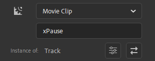
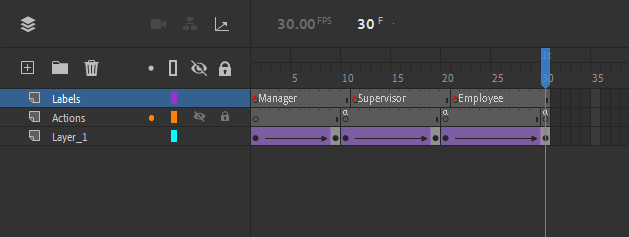

# Bound Movie Clips
Sometimes you want a MovieClip to react to the status of the Captivate movie, or perhaps the value of a Captivate variable. By naming a MovieClip in a certain way, CpMate will give it a special behaviour, binding the MovieClip to react in accord with what's happening in Captivate.

You can bind a MovieClip in several ways.

## xPause
MovieClip pauses when the Captivate Timeline pauses, and resumes when the Captivate timeline resumes.

This can be useful when you have a MovieClip showing a looping animation. If that animation continues to loop when the Captivate Timeline is paused, it may look a bit odd.

To bind a MovieClip in such a way, just name it: xPause

## xBindPlay
This naming convention allows you to play a different portion of a MovieClip's timeline depending on the value of a Captivate Variable.

You'll name the MovieClip: **xBindPlay\_\<INSERT VARIABLE NAME HERE\>**

When the animation starts in Captivate, CpMate will check the value of the bound variable, look through the MovieClip's frame labels and see if one matches it's current value. If so, it will start playing the MovieClip from that frame. If the Captivate Variable changes value, then CpMate will perform the check again.

### Example
Let's say you have a Captivate Variable called **JobRole**, which could potentially have one of three values:
- Manager
- Supervisor
- Employee

The learner should see a different animation depending on their job role. Therefore, you could add a MovieClip to the Animate Timeline and give it the following instance name: **xBindPlay_JobRole**

Within the MovieClip you can designate different portions of it's timeline to the animation for the different job roles. Let's say for example:
- (Frames 1 - 10) Manager
- (Frames 11 - 20) Supervisor
- (Frames 21 - 30) Employee

To make the MovieClip play the designated action on the designated frame you'd do the following:
- Frame 1 - Add the slide label: **Manager**
- Frame 10 - Add the action: this.stop();
- Frame 11 - Add the slide label: **Supervisor**
- Frame 20 - Add the action: this.stop();
- Frame 21 - Add the slide label: **Employee**
- Frame 30 - Add the action: this.stop();

Now, in Captivate, CpMate will ensure the correct animation will run for the correct value of the JobRole variable.

## xBindStop
xBindStop works the same as xBindPlay, except when jumping to the frame label it will not cause the timeline to play.

In much the same way, you'll name the MovieClip: **xBindStop\_\<INSERT VARIABLE NAME HERE\>**

Generally, xBindStop is used much more often than xBindPlay. Therefore, if you just write **xBind\_\<INSERT VARIABLE NAME HERE\>**, CpMate will assume you mean xBindStop.

### Example
Let's say you were making a multi-lingual course. To track the language of the course, you have a Captivate Variable called: **Language**

Depending on the course language the variable will have one of three values:
- English
- Spanish
- Mandarin

In your animation you have a MovieClip which just displays a picture. The picture includes writing, so you want to show a different picture depending on the language. Here's how you'd do that:

1. Name the MovieClip: **xBind_Language**
2. Inside the MovieClip add three frames.
3. On the first frame add the English picture and give that frame the label of: English
4. On the second frame add the Spanish picture and give that frame the label of: Spanish
5. On the third frame add the Mandarin picture and give that frame the label of: Mandarin

Now when the learner swaps between languages, the animation will display the correct picture.

::: tip Unique Names
Adobe Animate does not require every MovieClip instance to have a unique name. If you are concerned with that however, with all the binding names you can write an underscore '\_' followed by anything and the behaviour will still work.
:::

