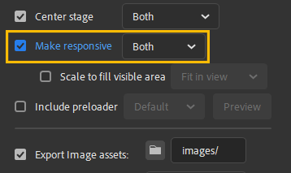
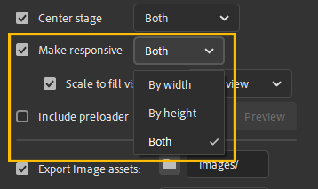
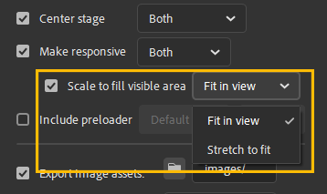

# X.preferences
This object many of the settings needed to configure CpMate to work just the way you want it.

## X.preferences.preview
Assign this the linkage name of a MovieClip in your library for CpMate to display that MovieClip when you test the movie.

The use of this only makes sense if you've already enabled [linkNameToLibrarySymbol](#x-preferences-linknametolibrarysymbol)

``` js
X.preferences.linkNameToLibrarySymbol = true;
X.preferences.preview = "animation_1";
```

[Learn more here](../building-animations/multiple-animations.html#previewing-animations-inside-movieclips)

## X.preferences.makeResponsive
When enabling [outerRendering](../building-animations/outer-rendering) or [custom stage sizes](../building-animations/custom=stage-size) certain publish settings in Adobe Animate will be overridden. One of them is the **make responsive checkbox**



This preference essentially controls the setting of that checkbox. By default CpMate will set it to **true**, which is the same as checked. To 'uncheck', this box, write the following:

``` js
// Checkbox off
X.preferences.makeResponsive = false;

// Checkbox on
//X.preferences.makeResponsive = true;
```

To choose the selection of the make responsive drop down, use **X.preferences.responsiveDirection**

## X.preferences.responsiveDirection
This preference equates to the **make responsive drop down** in the Adobe Animate publish settings.



The three choices of this drop down can be specified like so:

``` js
// Pick: Both (default)
X.preferences.responsiveDirection = "both";
// Pick: By width
X.preferences.responsiveDirection = "width";
// Pick: By height
X.preferences.responsiveDirection = "height";
```

If the programmer in you would like to do this a little cleaner, there is also a **X.preferences.responsiveDirections** object which holds static variables for each of these settings

``` js
// Pick: Both (default)
X.preferences.responsiveDirection = X.preferences.responsiveDirections.BOTH;
// Pick: By width
X.preferences.responsiveDirection = X.preferences.responsiveDirections.WIDTH;
// Pick: By height
X.preferences.responsiveDirection = X.preferences.responsiveDirections.HEIGHT;
```

## X.preferences.scaleType
This preference equates to the **Scale to fill visible area drop down** in the Adobe Animate publish settings.



The two choices of this drop down can be specified like so
``` js
// Pick: Fit in view (default)
X.preferences.scaleType = 1;
// Pick: Stretch to fit
X.preferences.scaleType = 2;
```

If the programmer in you would like to do this a little cleaner, there is also a **X.preferences.scaleTypes** object which holds static variables for each of these settings

``` js
// Pick: Fit in View 
X.preferences.scaleType = X.preferences.scaleTypes.FIT_IN_VIEW;
// Pick: Stretch to Fit
X.preferences.scaleType = X.preferences.scaleTypes.STRETCH_TO_FIT;
```

## X.preferences.outerRendering
Preference to enable/disable outer rendering.

This feature is discussed in depth [here](../building-animations/outer-rendering).

``` js
// On
X.preferences.outerRendering = true;
// Off
// X.preferences.outerRendering = false;
```

## X.preferences.stageWidth
Preference to set a custom stage width.

This feature is discussed in depth [here](../building-animations/custom-stage-size).

``` js
// Set stage width to 500 pixels.
X.preferences.stageWidth = 500;
```

## X.preferences.stageHeight
Preference to set a custom stage height.

This feature is discussed in depth [here](../building-animations/custom-stage-size).

``` js
// Set stage height to 1000 pixels.
X.preferences.stageHeight = 1000;
```

## X.preferences.linkNameToLibrarySymbol
Preference which allows you to house multiple animations in the library. When in Captivate, CpMate will pull the relevant animation out of the library and display it on screen. CpMate will pick the animation whose linkage matches the name of the Captivate Web Object.

This feature is discussed in depth [here](../building-animations/multiple-animations).

``` js
// On
X.preferences.linkNameToLibrarySymbol = true;

// Off
// X.preferences.linkNameToLibrarySymbol = false;
```
