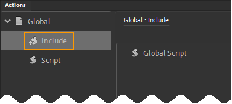
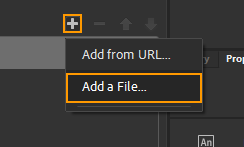
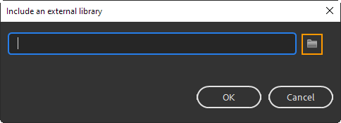
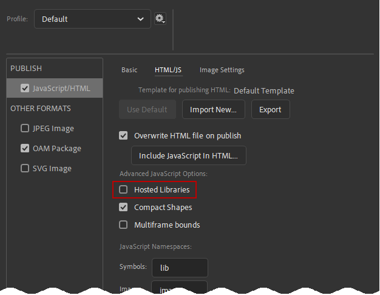

# Animate Config
Once you have bought CpMate you can install it in three steps.

### Step #1
Place the **Infosemantics_CpMate.js** folder you know you won't move or delete.
::: tip When working with a team
If you have multiple developers working on one course, all will be editing and publishing the Adobe Animate file. 

You will therefore need the *Infosemantics_CpMate.js* file *installed in the same folder on all machines*.

Therefore, we highly recommend creating a folder at the top of one of your drives (ideally the C Drive) and storing CpMate there.
Something like: C:\_PROJECTS\_RESOURCES\Infosemantics_CpMate.js

Otherwise, if each developer places the Infosemantics_CpMate.js file in a different location, they must repeat the following **step #2** each time they receive the Adobe Animate project.
:::

### Step #2
1. Create a new **HTML5 Canvas** Adobe Animate project.

2. Go to the Actions Panel.
3. In the left pane, click the down arrow next to 'Global', and select **Include**.

4. In the right pane, click the plus button. A drop down menu will appear. From there pick **Add a File**.

5. A dialog with appear. Click the folder icon to open up a file browser.

6. Browse to the folder you placed the **Infosemantics_CpMate.js** file in **step #1**. Select this file.
7. Click OK to the *Include an external library* dialog.

### Step #3
Animate has a feature called **hosted libraries**. This feature is enabled by default and it downloads essential Javascript files from the internet every time the Animate OAM is run. This can cause a variety of problems, so to prevent future technical support please do the following:
1. In Adobe Animate go to File > Publish Settings...
2. Select the Javascript/HTML settings.
3. Move to the HTML/js tab.
4. Uncheck Hosted Libraries.

## Next
Adobe Animate is now correctly configured. However, a few things must be configured in Adobe Captivate as well.
