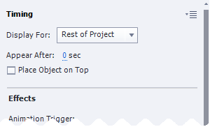
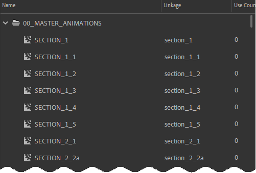
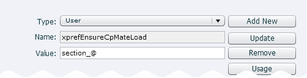

# Captivate Config
## Required Configurations
### CpExtra
CpMate requires CpExtra to be installed and working. To learn how to do that, [see the CpExtra help](https://widgetking.github.io/cpextra/).

### Turn on UseWidget7
This requires editing the AdobeCaptivate.ini file in your program files. If this edit is not made, you may be unable to interact with the Animate OAM in Captivate. Therefore, features requiring mouse interaction, such as sliders, will fail to work.
1. Close Adobe Captivate.
2. Go to your Captivate install folder. On windows, that will likely be: C:\Program Files\Adobe\Adobe Captivate \<VERSION\> x64
3. Duplicate the **AdobeCaptivate.ini** file and rename it **AdobeCaptivate_backup.ini**
::: tip
If something goes wrong with this process, you can rename AdobeCaptivate_backup.ini back to AdobeCaptivate.ini and everything should go back to normal.
:::
4. Paste a copy of the AdobeCaptiate.ini file on to your desktop and use a basic text editing program (such as Notepad on Windows) to open it.
5. Find the line that says...
```
UseWidget7 = 0
```
...and change it to...
```
UseWidget7 = 1
```
5. Save and close the file.
6. Move the AdobeCaptivate.ini on your desktop back into the Adobe Captivate install folder

::: warning
You will need Administrator privlidges to perform this step.

Additionally, you will have to redo this every time you install a new version of Captivate, or Captivate updates itself to a new minor version.
:::

## Recommended Configurations
With the required configurations complete you should now be able to [import animations into Captivate and view them](../purpose.html#here-s-how-it-works).

However, half the battle of making animations appear in Captivate is managing loading times. It would be a bad experience for the learners if they had to wait ten seconds for each animation to load. There are several ways you can avoid long loading times.

One important way is by using [X.preferences.linkNameToLibrarySymbol](../../features/javascript-api/preferences.html#linkNameToLibrarySymbol). With this feature you do not need a separate Adobe Animate project for each animation. All your animations will be included in a single OAM file. As long as that OAM file remains loaded, the learner's devices will not need to re-download all the animation assets for each animation.

The Animate OAM is loaded through a Captivate Web Object. However, when a Captivate Web Object leaves the timeline, Captivate automatically unloads all it's assets. 

What's the problem with that? Well, suppose you had the following setup:

- Slide 5: Animation #1
- Slide 6: No animation
- Slide 7: Animation #2
 
After watching Animation #1 on slide 5 and progressing to slide 6, all the script and graphic files the animation uses are unloaded. When you move into slide 7, the browser will need to load them all over again before the animation can play. This may mean several seconds of voice-over audio have already been played before the animation can even begin.

Therefore, the following configurations while not required, are recommended to reduce loading times and loading issues.

### Make the Animation OAM appear on every slide
1. Import the published Adobe Animate OAM on to the first visible slide of your Captivate project. Or drag the OAM out of the Captivate Library if its already there.
2. Scale the Web Object down so it is very small and place it in the bottom-right of the stage, so that just one or two pixels of it are showing.
3. Go to the Timing panel and set the Web Object to: Display for rest of project.



We are here assuming that all your animations are included in the same Adobe Animate file (thanks to X.preferences.linkNameToLibrarySymbol).

The advantage of doing this is all the Animation's OAM's required script and animation files are loaded at the start of the lesson and are **never unloaded**.

### Configure xprefEnsureCpMateLoad
Besides loading in required files, each Web Object needs some time to run it initialization code before playing an animation. Unfortunately, there is no way to speed this up. However, CpExtras **xprefEnsureCpMateLoad** preference variable cause's Captivate to pause playback until the animation is ready.

You can configure xprefEnsureCpMateLoad like so:
1. In Captivate go to Project > Variables
2. Create a new variable called xprefEnsureCpMateLoad
3. This is the important part. **assign xprefEnsureCpMateLoad an @syntax query which will match the name of all Web Objects loading CpMate animations.** 

To do this, you will need to work out a naming convention for all your animations. An example is shown in the screenshot of an Adobe Animate project's library below:



In the above example all the animations have a common naming convention. They all start with: 'section\_'. When displaying these animations in Captivate, we will be naming the Web Objects: section\_1, section\_1\_1, section\_1\_2 and so on. If we clue CpExtra into this naming convention, it will be able to detect when a Web Object with an animation is appearing on screen. It will then pause the Captivate's playback until it can be sure the animation is ready.
In this case, assigning the following value to xprefEnsureCpMateLoad will allow CpExtra to find all the Animation Web Objects:



The '@' in 'section\_@' is a wildcard which indicates any value could be placed there and the convention would still be met.
Let's suppose you had Web Objects in your movie named the following:

- section\_1
- section\_2
- 3\_section

The first two would match and get the special xprefEnsureCpMateLoad treatment. The third one does not match and would be treated as a regular Web Object.

::: tip
While we use the section\_@ convention as an example here, this is by no means the only correct convention. You could try anim\_@ or slide\_@ or something else which fits with the way you build courses.
:::

