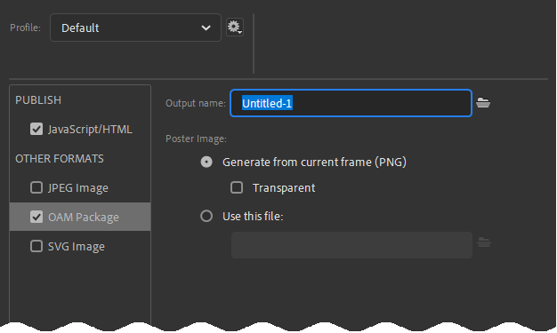
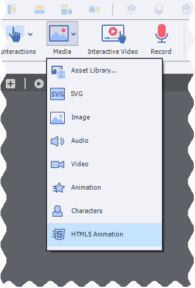
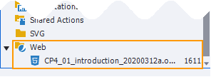
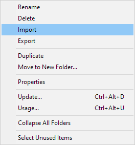

# Workflow
Now that everything is installed and configured, what is your day to day CpMate workflow going to look like?

Well, most of the time you won't be thinking about CpMate at all! You'll just be building animations inside of Adobe Animate. Once your animation is completed (or you want to test it), that's when your CpMate workflow kicks in.

You'll need to know how to do the following things:
1. Export OAM from Adobe Animate
2. Import OAM into Adobe Captivate
3. Time animations to the Captivate timeline.
4. Update the Animate OAM

## Export OAM from Adobe Animate

1. Build an animation inside of Adobe Animate.
::: tip
We HIGHLY recommend you look into [X.preferences.linkNameToLibrarySymbol](../features/javascript-api/preferences.html#x-preferences-linknametolibrarysymbol)
This feature allows you to use one animate document to hold multiple animations.
:::
2. Go to File > Publish Settings...
3. Check the OAM package export.

4. Publish the Adobe Animate project.

## Import OAM into Adobe Captivate
1. Inside your Captivate project, go to Media > HTML5 Animation

2. This will bring up a file browser where you'll navigate to (you guessed it) the .oam file you exported from Animate.
3. Place this animation where you desire it to appear on the Captivate stage.
4. (Optional) Select the Web Object. In the properties panel, turn off the scrollbar and border checkboxes. This will make the animation visually blend with the rest of the Captivate slide.
5. Preview or publish your Captivate project.

::: danger
The Animate OAM is essentially a webpage. This means Captivate will be displaying a webpage inside a webpage. Don't fret, this is a common technique in web development. However, web browsers are particularly observant of this practice. They monitor the communication between the parent web page and the child web page to make sure nothing unusual is happening. Generally speaking, as long as you're watching the Captivate project from a web server or local host server everything will be fine.

You can easily test from a local host server by choosing the correct Captivate preview option.

**In a normal project** you could choose:
- Preview > HTML5 in Browser

**In a responsive project** you could choose:
- Preview > Live Preview on Devices
- Preview > Project
- Preview > Next # Slides
:::

Everything going well you should see the Animate OAM's animation playing back inside Captivate. If not, check out our extensive [troubleshooting](../troubleshooting/about) section to track down your issue.

## Timing Animations
This is a topic that deserves it's own page, and it has one! [Click here to learn more.](../features/building-animations/captivate-syncing)

## Updating Animations
Inevitably, we will find something about our animation that we want to change. When that happens, go back to Adobe Animate, change the animation and export a new OAM.

Captivate's library allows you to update any object by right-clicking it and selecting **update** from the context menu. And good news: Web Objects appear right at the bottom of the library.

**However, updating the OAM in the Captivate Library will not work.** [As explained here](https://infosemantics.com.au/how-to-update-objects-in-adobe-captivate-projects/), Captivate has a weird bug which means Web Objects do not update when the new OAM has the same name as the old OAM.

The workaround is to:
1. Rename the OAM. (Something like: MyAnimation\_a.oam, MyAnimation\_b.oam, MyAnimation\_c.oam)
2. Use the Captivate Library's import option.

Navigate to the new OAM and select it.

You have successfully updated your animation.

