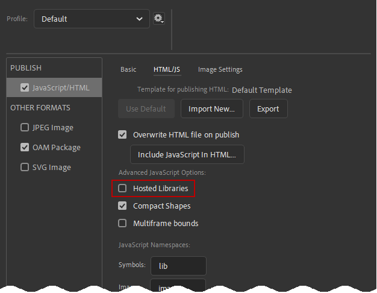
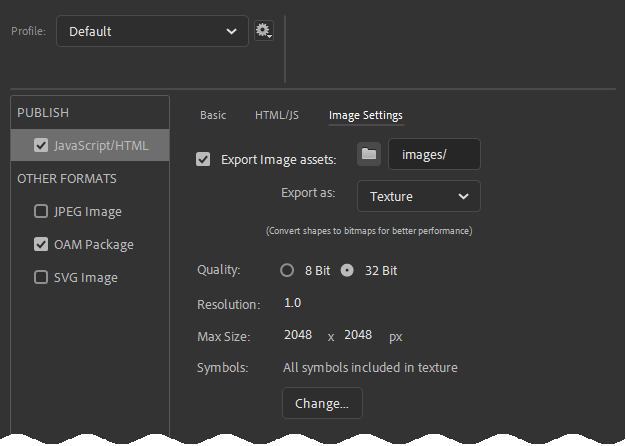
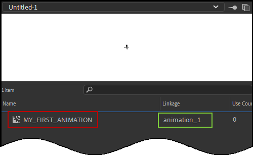

# Animation Playback

::: danger Hosted libraries again! Darn it!
We find very often these issues are caused by forgetting to turn off the hosted libraries option. Please ensure this is off.

:::


## In Adobe Captivate
### Playback Fails
#### Viewing from a file system
Are you watching the course straight off of your file system? If so you may be running into browser security issues because they don't like the Animate OAM webpage communicating with its parent Captiate webpage. Don't fret though. Browsers are fine with this kind of communication when it happens on a web server or a local host server. Try uploading your course to one of these and see whether that fixes the issue.

::: tip
You can easily test from a local host server from within Captivate.
**In a normal project:** Preview > HTML5 in Browser
**In a responsive project:** You could choose
- Preview > Live Preview on Devices
- Preview > Project
- Preview > Next # Slides
:::

#### Web Object has incorrect name

We're going to assume you're using X.preferences.linkNameToLibrarySymbol

### Starts playing partway in to animation
The Adobe Animate OAM probably hasn't had enough time to load and initialize before playing the animation. **CpExtra's xprefEnsureCpMateLoad** preference variable has been specifically designed to handle this situation. Please see the CpExtra help for instructions on setting up this variable.

### I've waited over a minute and the animation is not playing
When Adobe Animate loads in its image assets, if one assets takes more than a minute to load Adobe Animate will assume it will never load and give up. This could happen when you're dealing with an especially big sprite sheet and an especially bad internet connection.
To fix this: 
1. In Animate go to File > Publish Settings... 
2. Select the Javascript/HTML settings
3. Move to the Image Settings Tab. You should see a screen like this:



4. By default the **Resolution** option is set to 2.0. This means that the graphics will look niiiiiice when the animation plays back on a mobile phone. However, it does make the image files MUCH bigger. If you're trying to fix this problem we recommend turning this down to 1.0
5. The **Max Size** setting allows you to change the size of your sprite sheets. Sprite Sheets take all the images you've built in Adobe Animate and compile them into a single image. This allows them to load quicker. Knowing this you may be tempted to put everything into a few massive sprites sheets of 6000x6000 pixels or more. However, the bigger the sprite sheet the greater the risk it will take more than a minute to load on fabulously bad internet connections. So if you're encountering this issue, dial the size back until the animation plays reliably.

## In Adobe Animate
### Playback fails
#### Try clicking
If you have a this.stop(); action at the start of your timeline, then clicking the screen will send a this.play(); command through to the timeline.

#### Confirm X.preferences.preview is assigned a valid linkage name
If you're using X.preferences.linkNameToLibrarySymbol then you need to specify to CpMate which animation you want to view when you preview from Adobe Animate. This is done using X.preferences.preview.
However, as the picture below shows every symbol can be given a **Name (highlighted in red)** and a **Linkage (highlighted in green)**



X.preferences.preview will not work when assigned a MovieClip name. **It must be assigned the MovieClip's Linkage**
```javascript
X.preferences.linkNameToLibrarySymbol = true;

// If your project is set up according to the image above...
// ...this will work...
X.preferences.preview = "animation_1";

// ...this will not.
X.preferences.preview = "MY_FIRST_ANIMATION";
```

## Two animations playing at the same time
Is perhaps the following true:
- X.preferences.linkNameToLibrarySymbol is on.
- A MovieClip is on the Animate Main Timeline.

If that's the case, take the MovieClip off of the stage.
