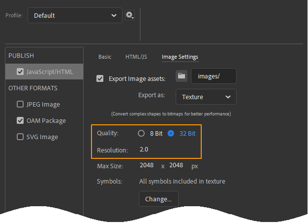

# Slow Playback
Building animations in Adobe Animate to run smoothly while still looking great is an artform in and of itself and WAAAY beyond the scope of the help on this site.
That said, if your animations are playing back slow there are a few Adobe Animate options you can tinker with.

## Sprite Sheet Resolution
If you're looking for a quick fix on slow playback, these two options might do the trick. You can find them like so:
1. Go to File > Publish Settings
2. In the Publish Settings dialog select the Javascript/HTML settings
3. Go to the Image Settings tab. You should find the **Quality** and **Resolution** settings below.

### Quality
The quality setting sets the quality of the .png image files that hold your sprite sheet. 32 Bit quality is top quality. Your animation assets should appear at the same quality that they do in Adobe Animate.

However, 32-bit images come at a cost. The resulting image files could be twice as large or higher, increasing the time they take to download. Additionally, they take more processing power to display.

An 8-bit sprite sheet however, will load and run much faster. However, the images may not look as good. Gradients will suffer especially. If you've been slaving over an animation for days, probably the last thing you want to do is display it with lower quality 8-bit graphics. However, lower quality graphics are a lot less distracting than low frame-rate playback.

### Resolution
This setting is related to screens with high pixel density. Ever wonder why your phone screen looks a whole lot more crisp than your computer screen? It's got more pixels crammed into a smaller space. This means it can render a picture at a greater level of detail. To take full advantage of this, you need to export your images at a higher resolution than they might technically take up. This resolution option allows you to set up how Adobe Animate does this.

However, same as with the previous setting, higher quality images result in larger downloads and weight on the CPU. While your animations will look _gorgeous_ on high density displays, they may play back slowly on under powered devices. So if you're having speed troubles, **set this to: 1** 
